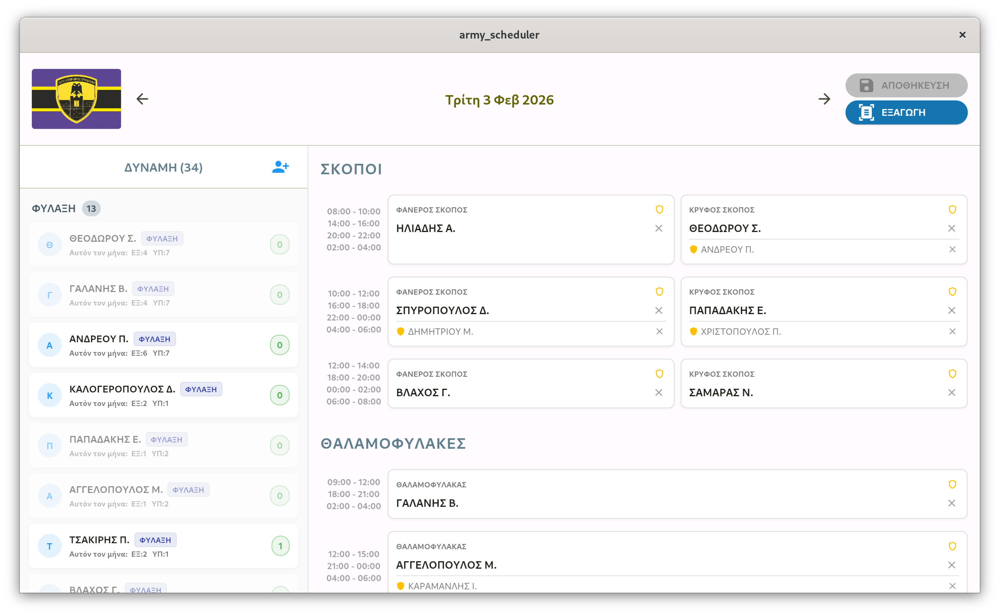
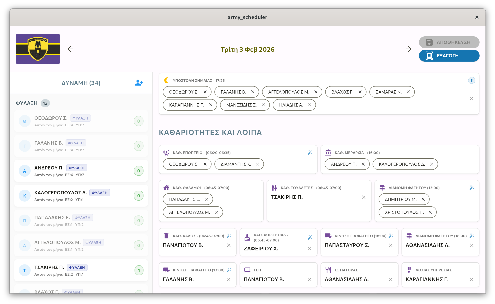
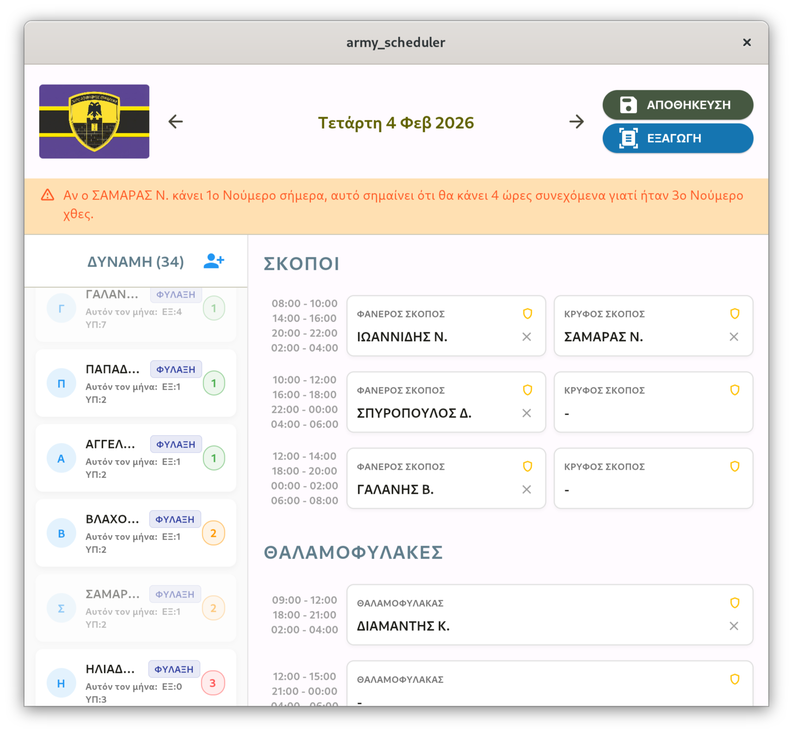
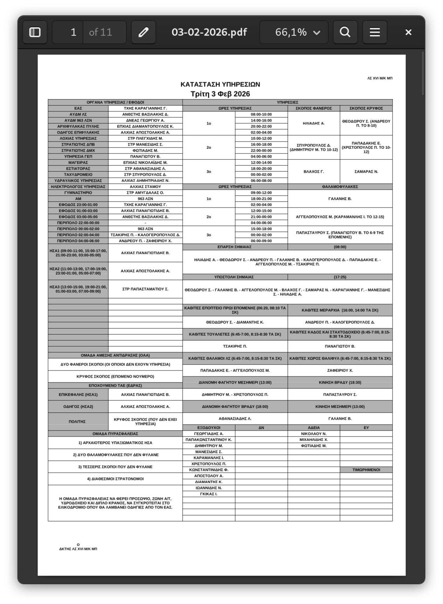
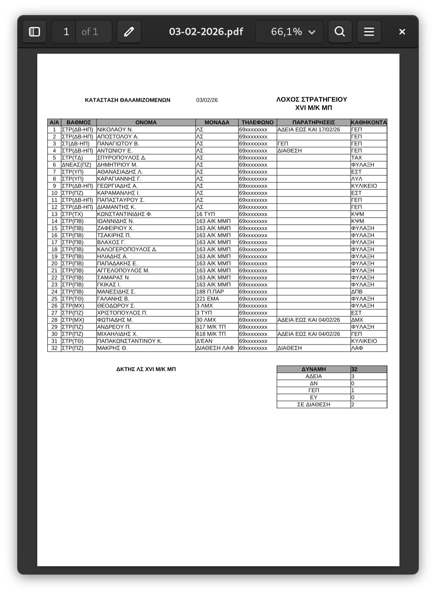
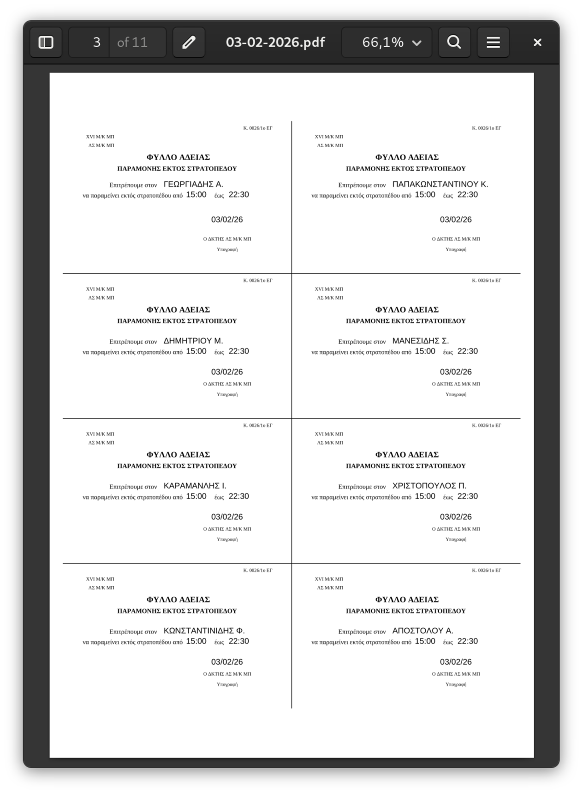
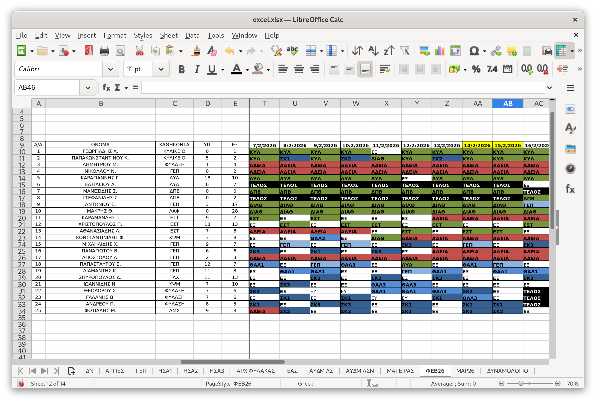

# Military Duty Scheduler

A Flutter desktop application for automating the creation of the daily schedule of the military
company that I served in. It provides an interface for scheduling soldiers to various posts and
duties, while enforcing rules and constraints.

## Context

In my mandatory military service one of my responsibilities was creating the daily schedule for the Company.
This was a repetitive and standardized task, and it was done manually using Excel, which was
time-consuming and prone to human error.

So I decided to create this app to automate part of the process, reduce human errors, and save
time, while still being backward-compatible with the existing Excel-based workflow.

## Screenshots

>All The names shown in all screenshots are fictional and used for demonstration purposes only.

### Daily Schedule View

Assign soldiers to guard posts (Σκοποί), dorm guards (Θαλαμοφύλακες), and all other duties for
each day. The left panel shows the full unit roster with each soldier's monthly duty count.





### Conflict Warnings

The app validates assignments in real time and flags scheduling conflicts — for example, if a
soldier would end up doing back-to-back 4-hour guard shifts across two consecutive days.



## Features

- **Daily scheduling** — assign soldiers to guard posts (Σκοποί), dorm guards (Θαλαμοφύλακες),
  ΓΕΠ, kitchen, and all other daily duties
- **Warnings** — validation rules that flag scheduling conflicts (e.g. back-to-back 4-hour shifts,
  flag ceremony overlaps, cleaning duty restrictions)
- **Excel import/export** — reads the master duty roster from `.xlsx`, writes assignments back to
  it, and exports formatted daily sheets (`ΥΠΗΡΕΣΙΕΣ`, `ΚΑΤΑΣΤΑΣΗ`, `ΟΑΑ-ΤΑΕ`, exit passes)
- **Persistent storage** — saves per-month data in `YY_MM/excel.xlsx` + `tasks.json` under the app
  documents directory; automatically loads the latest save on startup

## Exports

The app generates several print-ready PDF documents automatically.

### Services Sheet (Κατάσταση Υπηρεσιών)

A complete daily duty roster listing every post, soldier, and time slot — the document that is
officially announced and posted each day.



> **Note:** The export layout is fully customizable. The template is a standard Excel file
> (`assets/template.xlsx`), so any formatting changes — fonts, column widths, added rows — can be
> made directly in Excel without touching the app code.

### Soldier List (Κατάσταση Θαλαμιζομένων)

An automatically generated roster of all soldiers in the unit, including rank, unit assignment,
and duty role — ready to hand off to the duty officer.



### Exit Passes (Εξοδόχαρτα)

Individual exit permits are generated for every soldier granted leave for the day, pre-filled with
name, date, and permitted hours outside camp.



### Excel Backward Compatibility

All assignments are written back to the master Excel roster — the same file the unit was already
using before this app existed. This means the app fits into the existing workflow with zero
disruption: anyone can still open the file in LibreOffice or Excel and read or edit it as before.



## Asset Requirements

The app expects the following sheets in `assets/excel.xlsx`:

| Sheet                                              | Purpose                                   |
|----------------------------------------------------|-------------------------------------------|
| `ΜΑΡ26`, `ΑΠΡ26`, …                                | Monthly duty roster (one sheet per month) |
| `ΓΕΠ`, `ΜΑΓΕΙΡΑΣ`, `ΕΑΣ`, `ΑΥΔΜ ΛΣ`, `ΑΥΔΜ ΛΣΝ`  | Officer rotation sheets                   |
| `ΗΣΑ1`, `ΗΣΑ2`, `ΗΣΑ3`, `ΑΡΧΙΦΥΛΑΚΑΣ`             | CCTV / gate guard rotation sheets         |
| `ΔΝ`                                               | Home-sleeper (ΔΝ) soldier list            |
| `ΑΡΓΙΕΣ`                                           | Public holiday dates                      |
| `ΠΡΑΤΗΡΙΟ`                                         | Military market closed dates              |

A `assets/template.xlsx` is also required for the export feature — it contains the pre-formatted
print templates (`ΥΠΗΡΕΣΙΕΣ`, `ΕΞΟΔΟΧΑΡΤΑ`, `ΔΝ`, `ΟΑΑ-ΤΑΕ`, `ΚΑΤΑΣΤΑΣΗ`). Since this is a
plain Excel file, the layout of any exported document can be adjusted simply by editing the
corresponding sheet in `template.xlsx`.

## Data Persistence

On every save, the app writes two files to the application documents directory:

```
<AppName>/
└── YY_MM/              ← e.g. 26_03 for March 2026
    ├── excel.xlsx      ← updated duty roster
    └── tasks.json      ← OtherTasks assignments (reserves, cleaning, flags, …)
```

On next launch the app automatically picks up the most recent `YY_MM` folder.
